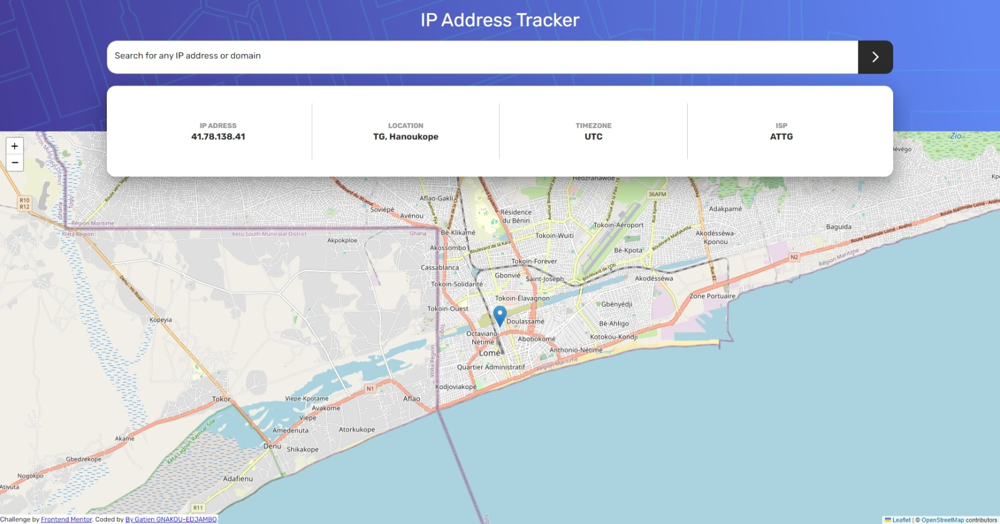

# Frontend Mentor - IP address tracker solution

This is a solution to the [IP address tracker challenge on Frontend Mentor](https://www.frontendmentor.io/challenges/ip-address-tracker-I8-0yYAH0). Frontend Mentor challenges help you improve your coding skills by building realistic projects. 

## Table of contents

- [Frontend Mentor - IP address tracker solution](#frontend-mentor---ip-address-tracker-solution)
  - [Table of contents](#table-of-contents)
  - [Overview](#overview)
    - [The challenge](#the-challenge)
    - [Screenshot](#screenshot)
    - [Links](#links)
  - [My process](#my-process)
    - [Built with](#built-with)
    - [What I learned](#what-i-learned)
    - [Continued development](#continued-development)
    - [Useful resources](#useful-resources)
  - [Author](#author)
  - [Acknowledgments](#acknowledgments)

**Note: Delete this note and update the table of contents based on what sections you keep.**

## Overview

### The challenge

Users should be able to:

- View the optimal layout for each page depending on their device's screen size
- See hover states for all interactive elements on the page
- See their own IP address on the map on the initial page load
- Search for any IP addresses or domains and see the key information and location

### Screenshot




### Links

- Solution URL: (https://github.com/Princinho/ip-address-tracker-master)
- Live Site URL: (https://ipsimple.netlify.app/)

## My process
I started by splitting the viewport into the two main sections.
The upper section with the image in background, and the second one which would contain the map later.
I built the upper section first and then added the results panel, (The white section in the middle)
I then added the map below but it was overlapping the results section. So I moved the results section into the same container as the map and then used absolute positionning and z-indexes to position them accordingly.
Next, I connected the IPify API and made sure I was retrieving the data correctly. I then displayed the returned data in the results section.
After that, I updated the map to display whatever location data is retrieved from the IPify API.
It made the map bug as there is no location data at the first render so I had to unmount it while the data is fetching and then mount it when the data is available.
### Built with

- Semantic HTML5 markup
- Flexbox
- CSS Grid
- Mobile-first workflow
- [React](https://reactjs.org/) - JS library
- [Material UI](https://nextjs.org/) - React UI library that implements Google's Material Design
- [Styled Components](https://mui.com/system/styled/) - For styles

**Note: These are just examples. Delete this note and replace the list above with your own choices**

### What I learned

Use this section to recap over some of your major learnings while working through this project. Writing these out and providing code samples of areas you want to highlight is a great way to reinforce your own knowledge.

I had used leaflet on a project in the past but this second experience helped me understand more concepts and 
have a clearer idea of how its setup works.
The map showed in sattered chunks at first but that was because the leaflet css wasn't correctly embedded
The funny thing is that when I embedded the css, the map disappeared altogether. It really left me scratching my head.
A couple searches later, I understood that I had to set a height on the map container.

```jsx
<MapContainer center={[locationInfo?.location.lat, locationInfo?.location.lng]}
            zoom={13} scrollWheelZoom={true}
            style={{
              height: `calc(100vh - ${backgroundHeight})`,/*height is required or map wont show*/
            }}>
```

### Continued development

Use this section to outline areas that you want to continue focusing on in future projects. These could be concepts you're still not completely comfortable with or techniques you found useful that you want to refine and perfect.
To go further, I would like to improve the map manipulation by increasing the zoom when an IP is located for instance. And maybe replace
the country code returned by the API by the country's name dynamically retrieved from another API.


### Useful resources

- [Adding dividers on flexbox items](https://stackoverflow.com/questions/41631136/add-dividing-line-between-flex-items-with-equal-space-distribution) - This helped me because I was confused when the borders I set to serve as a dividers were so close to the text.
- [Fixing marker not showing issue](https://stackoverflow.com/questions/60174040/marker-icon-isnt-showing-in-leaflet) - I couldn't understand why the marker wouldn't show on the published site. This article helped a lot. 


## Author

- Website - [Gatien GNAKOU-EDJAMBO](https://devgatien.netlify.app/)
- Frontend Mentor - [@Princinho](https://www.frontendmentor.io/profile/Princinho)
- LinkedIn - [@gatiengnakou](https://linkedin.com/in/gatiengnakou)

## Acknowledgments

Shout outs to all those StackOverflow users who keep sharing valuable information that keep us sane 😂

